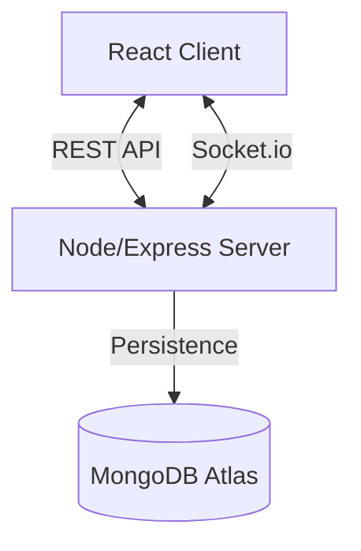

# 📊 Real-Time Poll Rooms — Full Stack Assignment

## 🚀 Overview
This project is a full-stack web application that allows users to create polls, share them via unique links, and collect votes with real-time result updates. The application focuses on correctness, fairness, usability, and a frictionless user experience.

In addition to the required features, I implemented several enhancements such as a **Guest Authentication system**, a **My Polls dashboard**, and tracking of created and voted polls, providing a more complete and product-oriented experience.

---

## ✨ Features

### ✅ Core Requirements (Assignment)
- **Create polls** with a question and multiple options.
- **Generate shareable poll links**.
- **Vote on polls** (single choice).
- **Real-time vote updates** using WebSockets.
- **Anti-abuse mechanisms** to prevent duplicate voting.
- **Persistent storage** using MongoDB.
- **Public poll access** without login.

### ⭐ Extra Enhancements (Beyond Assignment)
#### 👤 Guest Authentication (No Login Required)
The app automatically assigns a unique **device ID** stored in `localStorage`. This allows users to:
- Track polls they created.
- Track polls they voted on.
- Use the app without signup friction.
*This simulates anonymous session management used in real products.*

#### 📂 My Polls Dashboard
Users can view:
- Polls created from their device.
- Polls they have participated in.
*This provides a personalized experience while maintaining anonymity.*

#### 🧠 Smart Poll Ownership Tracking
- Each poll stores a `creatorId` so the system can fetch user-specific data.

#### 🎨 Improved UI/UX
- **Clean dark theme** with Glassmorphism styling.
- **Smooth transitions** and animations.
- **Clear voting feedback** (e.g., "✓ You have voted").
- **Copy link functionality** for easy sharing.
- **Responsive layout** for all devices.

---

## 🛡 Fairness / Anti-Abuse Mechanisms

### 1️⃣ IP Address Tracking
The backend records the **IP address** of voters to ensure:
- Only one vote per poll per IP.
- Prevention of cross-browser duplicate voting.
- Mitigation of vote spamming and multiple votes from the same network.

### 2️⃣ Browser Device Lock (Local Storage Token)
A local flag is stored after voting to prevent repeat voting from the same browser session. This prevents:
- Refresh abuse.
- Same device voting again.

### ⚠ Limitations of Fairness Approach
- Users on the same network (e.g., college WiFi) may be restricted.
- VPNs can bypass IP restrictions.
- Clearing browser storage resets device identity.
*These are acceptable tradeoffs for a lightweight system without mandatory authentication.*

---

## ⚙ Tech Stack

### 🖥 Frontend
- **React** (Vite)
- **React Router**
- **Axios**
- **Socket.io Client**
- **CSS** (Custom Glassmorphism Design)

### 🛠 Backend
- **Node.js**
- **Express.js**
- **Socket.io**
- **MongoDB Atlas**
- **Mongoose**
- **dotenv**

### ☁ Database
- **MongoDB Atlas** (Cloud Persistence)

### 🔌 Real-Time Communication
- **WebSockets via Socket.io** for live vote updates and poll synchronization.

---

## 🏗 Architecture

### 🔄 Application Flow
1. **Poll Creation**: User creates a poll → Backend saves with `creatorId` → Shareable link generated.
2. **Voting**: User selects option → Backend validates fairness → Vote stored → Socket broadcasts update.
3. **Dashboard**: Guest ID retrieved → Backend fetches user polls → Dashboard displays results.

---

## 📦 Database Schema

**Poll Model**
- `question`: String
- `options`: Array (text + vote count)
- `creatorId`: String
- `votedIps`: Array (IP tracking)
- `votedUserIds`: Array (User tracking)
- `createdAt`: Date

---

## 🧪 Edge Cases Handled
- Invalid or non-existent poll IDs.
- Duplicate voting attempts.
- Refresh persistence (state is maintained).
- Handling multiple open tabs.
- Network delays and input validation.

---

## 🔒 Security Considerations
- **Environment variables** for secrets.
- **MongoDB credentials** are not exposed.
- **Server-side validation** for duplicate votes.

---

## 🚀 Deployment (Example)
- **Frontend**: Vercel
- **Backend**: Render / Railway
- **Database**: MongoDB Atlas

---

## 🧠 Design Decisions
- **Why no login?** To reduce friction and simulate anonymous usage scenarios common in polling systems.
- **Why Socket.io?** Provides reliable real-time updates with minimal complexity.
- **Why MongoDB?** Flexible schema fits dynamic poll structure.

---

## 📈 Possible Future Improvements
- User accounts with authentication.
- Poll expiration timers.
- Rate limiting.
- Vote analytics.
- Admin moderation.
- IP hashing for privacy.
- Multi-device sync.

---

## 🏆 What Makes This Implementation Unique
- **Anonymous identity tracking.**
- **Personal dashboard without signup.**
- **Real-time synchronization.**
- **Product-level UX thinking.**
- **Strong fairness strategy.**
- **Clean architecture.**

---

## 🙌 Conclusion
This project demonstrates not only the required technical functionality but also thoughtful product design, scalability considerations, and user experience improvements. The additional features aim to simulate real-world polling platforms while maintaining simplicity.